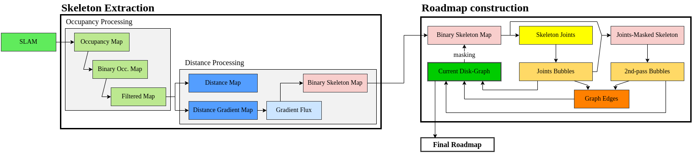

# skel_disk_graph_roadmap
Python implementation of the Skeleton-Disk-Graph Roadmap (SDGRM) planner.

*__Note__: This repo is intended for usage as a [ROS](https://wiki.ros.org/) metapackage containing 2 ROS packages responsible respectively for the planner itself and for utility code to support it, but the underlying code can easily be extracted and reused.*

The SDGRM planner is a deterministic roadmap, focused on safety and sparsity. Its principle is to rely on the occupancy data as input, computing the associated Signed Distance Field (SDF), from which a skeleton of the environment can be extracted.\
The skeleton is then sampled to place free-space bubbles which serve as the roadmap nodes; using such bubbles makes the distribution of the final roadmap nodes non-uniform and naturally adapted to local conditions (the nodes density is higher in areas of low SDF, i.e. close to the obstacles).




## Requirements
For ease of development, our implementation relies on a few (Python) libraries as dependencies. 

**Both packages**:
- numpy 
- matplotlib
- rospy

**extended_navigation_mapping**:
- cv2: image processing (*dilation/erosion process*)
- scikit-image: more image processing (*skeleton thinning*)
- scipy: distance computations

**skeleton_disk_graph_roadmap**:
- networkx: graph data structures and generic methods
- pqdict: priority queues (*for radius-descending disk-graph construction*)

## Getting started
The code is provided as two separate ROS packages:
- [extended_navigation_mapping](./extended_navigation_mapping) first provides tools to extend the ROS data structures for mapping and implements the preprocessing steps necessary to our method (distance and skeleton maps extraction). It also contains all the navigation-related aspects for exploration, i.e. utility code for paths handling and our implementation of a non-linear path following controller (see the paper for reference).

- [skeleton_disk_graph_roadmap](./skeleton_disk_graph_roadmap) provides the core implementation of the roadmap construction method and of the exploration strategy as a ROS-agnostic python module, wrapped in a ROS package for usability in a more experimental context. We provide ROS launch files to run the SDGRM only as a planning roadmap or to run the full exploration controller, along with the corresponding RViz visualizations.

For each package:
- the `src/nodes` folder contains executable ROS nodes
- the `config` folder contains corresponding example configurations 
- the `launch` folder contains example ROS launch files

Custom ROS messages and services are also defined in each package's `msg` and `srv` folder.

**Note**: if you only wish to use the method in a ROS-agnostic context, the essential necessary code is everything located in [`skeleton_disk_graph_roadmap/src/sdg_roadmap`](./skeleton_disk_graph_roadmap/src/sdg_roadmap) and the appropriate dependencies from [`extended_navigation_mapping/src/extended_mapping`](./extended_navigation_mapping/src/extended_mapping) (for skeleton extraction) and [`extended_navigation_mapping/src/navigation_utils`](./extended_navigation_mapping/src/navigation_utils) (for paths utilities).

---
### Running the example script
A Python-only [demo script](./skeleton_disk_graph_roadmap/src/examples/sdg_roadmap_demo.py) is available which you can simply run using 
````
python3 sdg_roadmap_demo.py
````
It demonstrates all the steps of the method (skeleton extraction, disk-graph construction, path planning, exploration path selection) on a standard [occupancy map](./skeleton_disk_graph_roadmap/environments/env_intellab.png).

---
### Running the Skeleton Disk-Graph Roadmap in ROS
Our method can be used either for pure planning, i.e. to maintain a roadmap of the environement which can be updated at will and queried for paths when needed, or for exploration, using the disk-graph roadmap to autonomously select and execute navigation paths.

**Required setup**\
We assume that you already have the lower-level components (sensors, robot interface...) and a SLAM system of your choice (in our case, we use [rtabmap](http://wiki.ros.org/rtabmap_ros)) integrated in ROS. Specifically, the requirements of the method are:
- a link in the ROS `tf` tree between the `<map_frame>` and `<agent_frame>` frames (*see example config. files*)
- a ROS node (usually the SLAM node) providing a **service** of type `nav_msgs/GetMap` serving the source occupancy map

#### Running the skeleton extraction
The skeleton extraction process is split between two ROS nodes:
- the [occupancy preprocessing server](./extended_navigation_mapping/src/nodes/occupancy_preproc_server.py) which queries the source occupancy service and applies the smoothing process (dilation + erosion of the obstacles) described in the paper.
    - Example [configuration file](./extended_navigation_mapping/config/occupancy_preproc/occ_preproc_config.yaml):
        ```yaml
        occupancy_map_service: "rtabmap/get_map" # Source occupancy service
        subsampling: 1.                          # Map subsampling (ratio)
        dil_erosion_dist: 0.6                    # Dilation + erosion distance (meters) applied for preprocessing
        obstacles_threshold: 0.51                # Occupancy threshold above which a cell is considered occupied
        ```
    - Published topics :
        ```
        /<node_name>/processed_map                  nav_msgs/OccupancyGrid
        /<node_name>/processed_binary_map           nav_msgs/OccupancyGrid
        ```
    - Provided services :
        ```
        /<node_name>/get_processed_map              nav_msgs/GetMap
        /<node_name>/get_processed_binary_map       nav_msgs/GetMap
        ```
- the [distance map server](./extended_navigation_mapping/src/nodes/distance_map_server.py) queries the occupancy preprocessing server and provides services to query the distance map or the skeleton map.
    - Example [configuration file](./extended_navigation_mapping/config/distance_mapping/dist_server_config.yaml):
        ```yaml
        occupancy_map_service: "/occupancy_preprocessing/get_processed_binary_map" # Source occupancy service
        distance_offset: 0.2                # Distance boundary offset (meters)
        skeleton_flux_threshold: -0.01      # Flux threshold for skeleton extraction
        update_rate: 2                      # Fixed update rate
        ```
    - Published topics :
        ```
        /<node_name>/distance       extended_navigation_mapping/EnvironmentGridMap
        /<node_name>/dist_as_occ    nav_msgs/OccupancyGrid
        /<node_name>/grad_x         extended_navigation_mapping/EnvironmentGridMap
        /<node_name>/grad_y         extended_navigation_mapping/EnvironmentGridMap
        /<node_name>/skeleton       extended_navigation_mapping/EnvironmentGridMap
        ```
    - Provided services :
        ```
        /<node_name>/get_distance               extended_navigation_mapping/GetDistance
        /<node_name>/get_distance_skeleton      extended_navigation_mapping/GetDistanceSkeleton
        ```

*Note that the distance map server can be set up to query directly the SLAM occupancy service, but the raw map noise usually leads to decreased performance compared to using the intermediary occupancy preprocessing node.*

A launch file [distance_mapping.launch](./extended_navigation_mapping/launch/distance_mapping.launch) is provided to run those 2 nodes using the example configuration.

#### _Optionnal_ : running the navigation controller
*__Note__: This part is only needed if you intend to use the path-following controller and/or the exploration node. If you only wish to use the SDGRM as a pure path-planner, you can skip directly to the [next section](#running-the-sdgrm-in-planning-mode).*

The navigation is also managed by two separate ROS nodes:
- the [agent distance publisher node](./extended_navigation_mapping/src/nodes/agent_dist_publisher.py) is a helper node which subscribes to the distance map and publishes the distance between the agent and the obstacles
    - Example [configuration file](./extended_navigation_mapping/config/navigation/agent_dist_publisher_config.yaml):
        ```yaml
        dist_server_node_name: "dist_server" # Name of the distance mapping server
        map_frame: "map"                     # Reference TF frames
        agent_frame: "base_link" 
        ```
    - Published topics :
        ```
        /agent_dist                  std_msgs/Float64
        ```
- the [path following server](./extended_navigation_mapping/src/nodes/path_following_server.py) implements a standard non-linear path following algorithm, wrapped in a ROS node
    - Example [configuration file](./extended_navigation_mapping/config/navigation/path_following_config_sim.yaml):
        ```yaml
        frames: {
            agent_frame: "base_link",
            map_frame: "map"
        } # Reference frames
        pub_topics: {
            vel_topic: "/cmd_vel"
        } # Output vel. command topic
        sub_topics: {
            agent_obst_dist: "/agent_dist"
        } # Input agent dist. topic
        controller: {
            desired_linear_vel: 0.4,
            max_angular_vel: 0.25,
            k2: 4,
            k3: 3,
            success_goal_dist: 0.25,
            agent_radius: 0.2
        } # Control parameters
        ```
    - Published topics :
        ```
        /<pub_topics>/<vel_topic>   geometry_msgs/Twist
        ```
    - Subscribed topics:
        ```
        /<node_name>/set_des_lin_vel        std_msgs/Float64
        /<node_name>/set_max_rot_vel        std_msgs/Float64
        ```
    - Provided services :
        ```
        /<node_name>/follow_path               extended_navigation_mapping/FollowPathAction
        ```
A launch file [safe_path_following.launch](./extended_navigation_mapping/launch/safe_path_following.launch) is provided to run those 2 nodes using the example configuration.

---
We now have all the pre-requisites needed to run the main [SDG roadmap node](./skeleton_disk_graph_roadmap/src/nodes/skel_disk_graph_node.py). The code is structured so that this node can be run in different modes:
- pure planning: the SDG roadmap node only provides services to update the roadmap and query paths
- planning + navigation: the node integrates with the navigation nodes to provide an additional navigation service, which plans a path and executes it when queried with a goal 
- planning + navigation + exploration: the node uses the strategy described in the paper to autonomously select navigation targets and explore the environment

The choice of the mode is handled by a [configuration file](./skeleton_disk_graph_roadmap/config/skel_disk_graph_config.yaml), allowing to enable or disable the sub-components of the node.

#### Running the SDGRM in planning mode
 This node provides services to update the roadmap and query paths between 2 configurations, but has no information of the agent localization in the environment.
- Example [configuration file](./extended_navigation_mapping/config/distance_mapping/dist_server_config.yaml):
    ```yaml
    frame: "map"
    agent_frame: "base_link"
    distance_mapping_server: "dist_server"
    occupancy_map_service: "/occupancy_preprocessing/get_processed_map"

    sdg:   
    # Roadmap construction
        min_jbubbles_rad: 0.4       # Minimum radius for the junctions bubbles
        min_pbubbles_rad: 0.3       # Minimum radius for the 2nd-pass bubbles
        bubbles_dist_offset: 0.0    # Offset applied to the bubbles radii
        knn_checks: 40              # Number of nearest-neighbors for knn checks        
    ```
- Published topics:
    ``` 
    /<node_name>/disk_graph                     skeleton_disk_graph_roadmap/DiskGraph
    /<node_name>/logging/graph_size/edges       std_msgs/Int32
    /<node_name>/logging/graph_size/nodes       std_msgs/Int32
    /<node_name>/planned_path                   nav_msgs/Path
    ```
- Provided services:
    ```
    /<node_name>/get_disk_graph         skeleton_disk_graph_roadmap/GetDiskGraph
    /<node_name>/plan_path              skeleton_disk_graph_roadmap/PlanPath
    /<node_name>/update_planner         std_srvs/Empty
    ```

#### Running the SDGRM in navigation mode
(TODO) detail usage in the planning+navigation case

#### Running the SDGRM in exploration mode
(TODO) detail usage in the exploration case

#### RViz visualization
(TODO) Document the visualizer config.

## Cite this work
The code in this repo is an implementation of the method we present in the following paper (*currently under review*):
> *Skeleton Disk-Graph Roadmap: a Sparse Deterministic Roadmap for Safe 2D Navigation and Exploration* - T.Noël, A.Lehuger, E.Marchand, F.Chaumette
